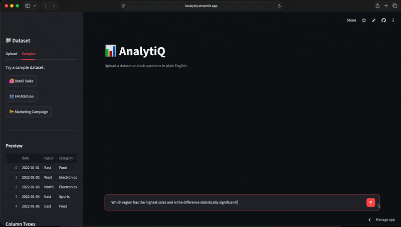

# 📊 AnalytiQ — Autonomous Data Analyst



> Upload a dataset. Ask questions in plain English. Get statistically rigorous answers.

AnalytiQ is an agentic AI system that lets non-technical users perform professional-grade data analysis through natural language. It combines a multi-step LangGraph agent with classical statistical methods — so the LLM handles reasoning while trusted Python libraries handle all computation.

---

## 🎯 Why AnalytiQ?

Most "AI data analyst" tools just pass your question to an LLM and hope the answer is correct. AnalytiQ is different:

| | Typical AI Chatbot | AnalytiQ |
|---|---|---|
| Statistics | LLM guesses | SciPy / Statsmodels computes |
| Multi-step reasoning | Single response | LangGraph agent loop |
| Hallucination risk | High | Low — LLM never does math |
| Evaluation | None | 12-query benchmark (100% accuracy) |

---

## 🏗️ Architecture

```
User Query
    │
    ▼
┌─────────────────────────────────┐
│         LangGraph Agent         │
│                                 │
│  ┌──────────┐  ┌─────────────┐ │
│  │  Planner │→ │ Tool Router │ │
│  └──────────┘  └──────┬──────┘ │
│                        │        │
│         ┌──────────────┼──────────────┐
│         ▼              ▼              ▼
│   ┌──────────┐  ┌──────────┐  ┌──────────┐
│   │ run_eda  │  │run_stats │  │ run_viz  │
│   │  Pandas  │  │  SciPy   │  │  Plotly  │
│   └──────────┘  └──────────┘  └──────────┘
│         │              │              │
│         └──────────────┴──────────────┘
│                        │
│                  Tool Result
│                        │
│                  ┌─────▼─────┐
│                  │Synthesizer│
│                  └─────┬─────┘
└────────────────────────┼────────────────┘
                         ▼
                   Natural Language
                      Answer
```

The LLM (Groq `llama-3.3-70b-versatile`) acts as a **planner and synthesizer only** — it never performs calculations. All numerical work is delegated to:
- `run_eda` — Pandas-based exploratory analysis
- `run_stats` — SciPy/Statsmodels statistical tests
- `run_aggregation` — Pandas group-by aggregations
- `run_viz` — Plotly visualizations

---

## ✨ Features

- **Natural language interface** — no SQL, no Python, no statistics knowledge required
- **Multi-step reasoning** — agent chains multiple tools when needed
- **Statistical rigor** — correlation, t-test, ANOVA, normality testing via SciPy
- **Interactive visualizations** — histograms, bar charts, scatter plots, heatmaps, boxplots
- **Data quality detection** — automatically flags missing values and duplicates
- **Anti-hallucination design** — LLM never computes numbers directly
- **Conversation memory** — follow-up questions understood in context
- **Sample datasets** — retail sales, HR attrition, marketing campaign

---

## 📊 Evaluation

AnalytiQ was evaluated on a 12-query benchmark testing tool routing accuracy:

| Category | Queries | Correct |
|---|---|---|
| EDA & Overview | 2 | 2/2 |
| Statistical Analysis | 3 | 3/3 |
| Visualizations | 4 | 4/4 |
| Aggregation | 2 | 2/2 |
| Mixed / Multi-step | 1 | 1/1 |
| **Total** | **12** | **12/12 (100%)** |

Run the benchmark yourself:
```bash
PYTHONPATH=. python3 tests/eval_benchmark.py
```

---

## 🛠️ Tech Stack

| Component | Technology |
|---|---|
| Frontend | Streamlit |
| Agent Orchestration | LangGraph |
| LLM | Groq (llama-3.3-70b-versatile) |
| Statistical Analysis | SciPy, Statsmodels |
| Data Processing | Pandas, NumPy |
| Visualizations | Plotly |
| LLM Framework | LangChain |

---

## 🚀 Getting Started

**1. Clone the repository**
```bash
git clone https://github.com/CaptainLevy/analytiQ.git
cd analytiQ
```

**2. Create virtual environment**
```bash
python3 -m venv venv
source venv/bin/activate
```

**3. Install dependencies**
```bash
pip install -r requirements.txt
```

**4. Set up environment variables**
```bash
cp .env.example .env
# Add your Groq API key to .env
```

**5. Run the app**
```bash
PYTHONPATH=. streamlit run app/main.py
```

---

## 💡 Example Questions

**EDA**
- "Give me an overview of this dataset"
- "Are there any data quality issues?"

**Statistics**
- "Is there a significant difference in sales across regions?"
- "What is the correlation between sales and profit?"
- "Is profit normally distributed?"

**Visualizations**
- "Show me the distribution of sales"
- "Show me a correlation heatmap"
- "Show me average profit by category as a bar chart"

**Multi-step**
- "Which region has the highest sales and is the difference statistically significant?"
- "Which product category is most profitable and how does it compare to others?"

---

## 📁 Project Structure

```
analytiQ/
├── app/
│   ├── tools/
│   │   ├── eda.py          # Pandas-based EDA
│   │   ├── stats.py        # SciPy statistical tests
│   │   └── viz.py          # Plotly visualizations
│   ├── prompts/
│   │   └── system.py       # LLM system prompt
│   ├── agent.py            # LangGraph agent
│   └── main.py             # Streamlit frontend
├── tests/
│   ├── test_tools.py       # Unit tests (22/22)
│   └── eval_benchmark.py   # Accuracy benchmark (12/12)
├── data/
│   ├── retail_sales.csv
│   ├── hr_attrition.csv
│   └── marketing_campaign.csv
├── requirements.txt
└── README.md
```

---

## 🔑 Environment Variables

Create a `.env` file:
```
GROQ_API_KEY=your_groq_api_key_here
```

Get a free API key at [console.groq.com](https://console.groq.com).

---

*Built by [Ankit Kumar](https://github.com/CaptainLevy)*